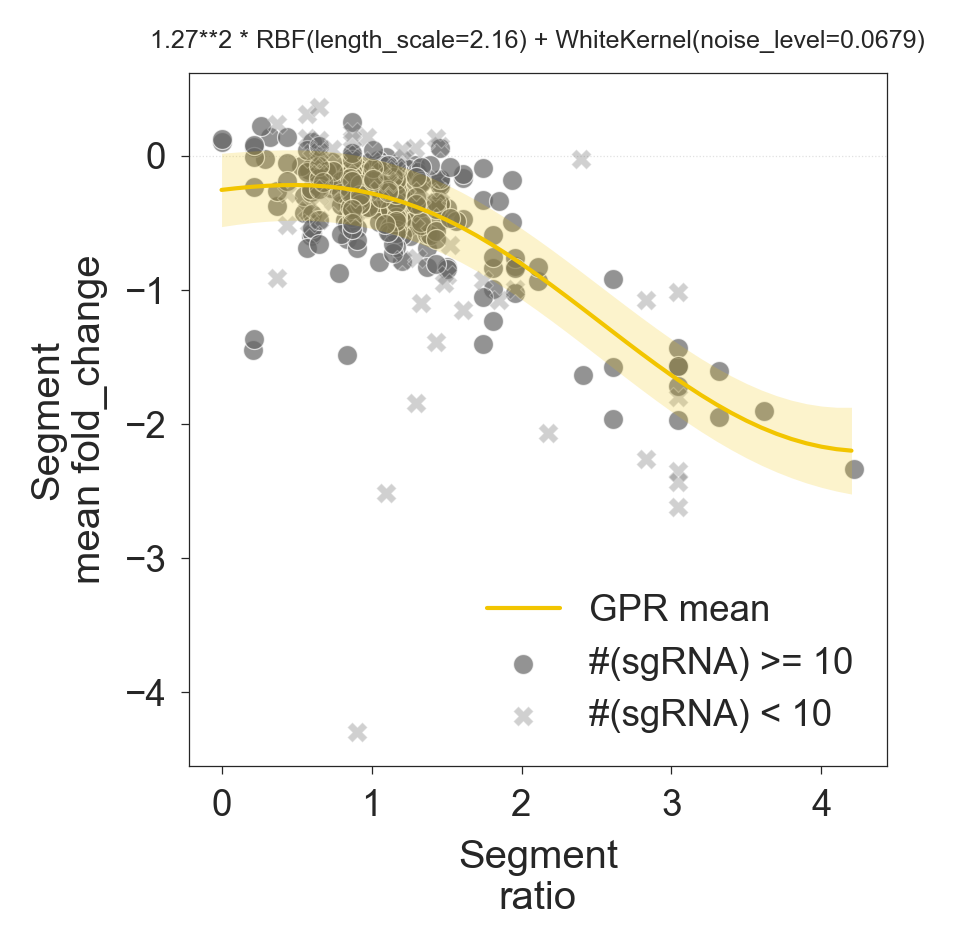

[](https://opensource.org/licenses/BSD-3-Clause) [](https://badge.fury.io/py/cy) [](https://doi.org/10.5281/zenodo.2530755)


Module wih utility function to process CRISPR-based screens and method to correct gene independent copy-number effects.


Description
--
Crispy uses [Sklearn](http://scikit-learn.org/stable/index.html) implementation of [Gaussian Process Regression](http://scikit-learn.org/stable/modules/generated/sklearn.gaussian_process.GaussianProcessRegressor.html#sklearn.gaussian_process.GaussianProcessRegressor), fitting each sample independently.

Install
--

Install [`pybedtools`](https://daler.github.io/pybedtools/main.html#quick-install-via-conda) and then install `Crispy`

```
conda install -c bioconda pybedtools

pip install cy
```

Examples
--
Support to library imports:
```python
from crispy.CRISPRData import Library

# Master Library, standardised assembly of KosukeYusa V1.1, Avana, Brunello and TKOv3 CRISPR-Cas9 libraries.
master_lib = Library.load_library("MasterLib_v1.csv.gz")


# Genome-wide minimal CRISPR-Cas9 library. 
minimal_lib = Library.load_library("MinLibCas9.csv.gz")

# Some of the most broadly adopted CRISPR-Cas9 libraries:
# 'Avana_v1.csv.gz', 'Brunello_v1.csv.gz', 'GeCKO_v2.csv.gz', 'Manjunath_Wu_v1.csv.gz', 'TKOv3.csv.gz', 'Yusa_v1.1.csv.gz'
brunello_lib = Library.load_library("Brunello_v1.csv.gz")
```

Copy-number correction:
```python
import crispy as cy
import matplotlib.pyplot as plt

# Import data
rawcounts, copynumber = cy.Utils.get_example_data()

# Import CRISPR-Cas9 library
lib = cy.Utils.get_crispr_lib()

# Instantiate Crispy
crispy = cy.Crispy(
    raw_counts=rawcounts, copy_number=copynumber, library=lib
)

# Fold-changes and correction integrated funciton.
# Output is a modified/expanded BED formated data-frame with sgRNA and segments information
bed_df = crispy.correct(x_features='ratio', y_feature='fold_change')
print(bed_df.head())

# Gaussian Process Regression is stored
crispy.gpr.plot(x_feature='ratio', y_feature='fold_change')
plt.show()
```



Credits and License
--
Developed at the [Wellcome Sanger Institue](https://www.sanger.ac.uk/) (2017-2019).

For citation please refer to:

[Gonçalves E, Behan FM, Louzada S, Arnol D, Stronach EA, Yang F, Yusa K, Stegle O, Iorio F, Garnett MJ (2019) Structural 
rearrangements generate cell-specific, gene-independent CRISPR-Cas9 loss of fitness effects. Genome Biol 20: 27](https://doi.org/10.1186/s13059-019-1637-z)
